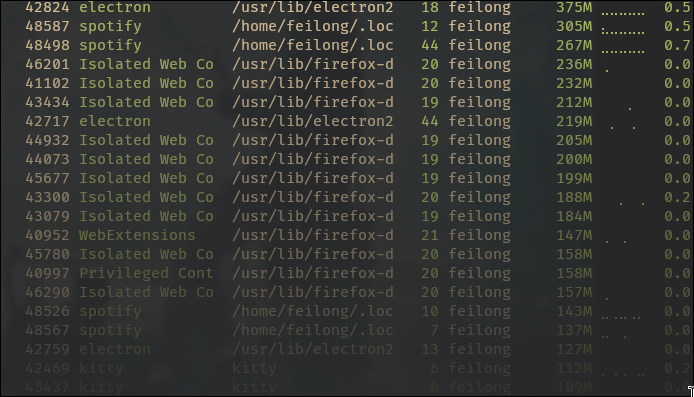

# monitoring_101

## Area of Concerns

### CPU
The load average is the average of the load number of actively
running processes, queuing processes, and sleeping processes
over a period of time.

The load averages is displayed in this format:
`Load AVG: 0.45 0.17 0.12`

The numbers represents the average the system has been utilized
for the past 1, 5, 15 minutes respectively. If our objective is
to fully use our system, then we should aim for `1.0`.

Checking that the temperature of the machine doesn't overheat
is also important to avoid a deterioration of the performance,
as well as a forced shutdown.

### Ram and SWAP usage
Whenever all the RAM are used up, the SWAP space in the storage 
is used instead. Resorting to SWAP results in a drop of the
system performances because the I/O speed is not as fast as 
with RAM. This also results in using more CPU cycles to manage
virtual memory swapping. Therefore, checking that we always
have enough RAM available is very important if we want to
our machine to stay performant.

### File System Space usage
One needs to always check if there is enough available space
in the storage, downloading and upgrading packages wouldn't be
possible otherwise. Always check if there are some old caches
or logs that we could get rid of.

### Network traffic
Checking the network traffic is very important to check that
the machine isn't using more bandwith than it's supposed to.
Also monitoring the traffic and looking for any malicious 
actor to prevent any attacks.

## Checking Memory Intensive Processes
### What are Processes ?
A **process** is a set of instructions processed by the 
processor, that are usually run in the background. Processes
manipulates, alter, or view data.

A typical computer has multiple processes running at all times
to manage the OS, hardwares and softwares.

### How to check Processes ?
One can check the different processes running with the command
`top`, its other variants (ex. `htop`, `btop`, etc.

## Working with Log Files
Systemd logging system is stored in `/var/log/journal/` by
default. To consult them, you can use the command `journalctl`

## Monitoring Users
A root user could monitor the users in different ways. Reading
the `.bash_history` in a user's home directory is a way to
know what they have been doing in the terminal. 

However, that `.bash_history` could be deleted or altered by 
its user, or he could avoid leaving its prints by using the 
GUI. A more consistent way would be to monitor the processes 
with top and sort them by its users.

Another useful command is `w`. This displays the logged in
users as well as their current process, and average CPU load

## Machine Uptime
`uptime`

## Assessing Network Traffic
`nethogs`

